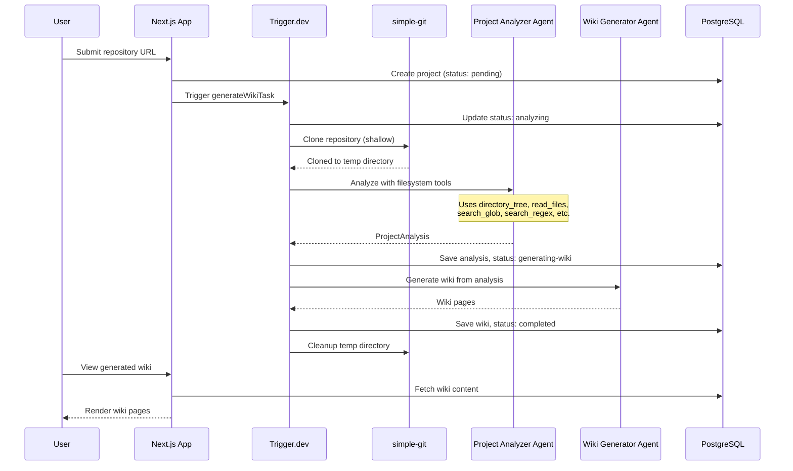

# AutoWiki

AI-powered documentation generator for your codebase. Connect a GitHub
repository and get a comprehensive wiki in minutes.

## Overview

AutoWiki uses AI agents to analyze your codebase and generate beautiful,
navigable wiki documentation. Simply provide a GitHub repository URL and
AutoWiki will:

1. **Connect your repo** — Paste any public GitHub URL
2. **AI analyzes your code** — Understands structure & patterns
3. **Get your wiki** — Auto-generated documentation

## Tech Stack

- **Framework**: [Next.js](https://nextjs.org) with App Router
- **AI Agents**: [Mastra](https://mastra.ai) for building AI agents
- **Background Jobs**: [Trigger.dev](https://trigger.dev) for long-running tasks
- **Database**: [Neon](https://neon.tech) (PostgreSQL) with
  [Drizzle ORM](https://orm.drizzle.team)
- **API**: [tRPC](https://trpc.io) for type-safe APIs
- **Styling**: [Tailwind CSS](https://tailwindcss.com) with
  [shadcn/ui](https://ui.shadcn.com)

## How It Works

AutoWiki uses two specialized AI agents:

### Project Analyzer Agent

Clones repositories locally and uses custom filesystem tools to:

- Understand project structure and architecture
- Identify features and their implementations
- Map code dependencies and data flows
- Extract key files and their purposes

### Wiki Generator Agent

Transforms the analysis into documentation:

- Creates a home page with project overview
- Generates feature pages with technical details
- Adds cross-references between related pages
- Links directly to source files on GitHub

## Architecture



## Getting Started

### Prerequisites

- [Bun](https://bun.sh) (recommended) or Node.js 20+
- PostgreSQL database (we recommend [Neon](https://neon.tech))
- [Trigger.dev](https://trigger.dev) account
- OpenAI or Google AI API key

### Installation

1. Clone the repository:

```bash
git clone https://github.com/your-org/autowiki.git
cd autowiki
```

2. Install dependencies:

```bash
bun install
```

3. Set up environment variables:

```bash
cp .env.example .env
```

Configure the following variables:

```env
# Database (Neon PostgreSQL recommended)
DATABASE_URL="postgresql://..."

# API Keys (at least one AI provider required)
OPENAI_API_KEY="sk-..."
GOOGLE_GENERATIVE_AI_API_KEY="..."

# AI Models for analysis and generation
ANALYZER_MODEL="openai/gpt-5-mini"
GENERATOR_MODEL="openai/gpt-5-mini"

# Trigger.dev secret key
TRIGGER_SECRET_KEY="tr_dev_..."
```

4. Run database migrations:

```bash
bun drizzle-kit push
```

5. Start the development server:

```bash
bun dev
```

6. In a separate terminal, start the Trigger.dev worker:

```bash
bunx trigger.dev dev
```

Open [http://localhost:3000](http://localhost:3000) to use AutoWiki.

## Project Structure

```
src/
├── app/                    # Next.js App Router pages
│   └── projects/           # Wiki viewer
├── components/             # React components
├── db/                     # Database schema and client
├── mastra/                 # AI agents
│   ├── agents/             # Agent definitions
│   └── tools/              # Filesystem tools for repo analysis
├── schemas/                # Zod schemas
├── trigger/                # Background tasks
└── trpc/                   # tRPC routers
```

## Author

Created with ❤️ by
[Sheikh Uzair Hussain](https://www.linkedin.com/in/sheikhuzairhussain)

## License

MIT
