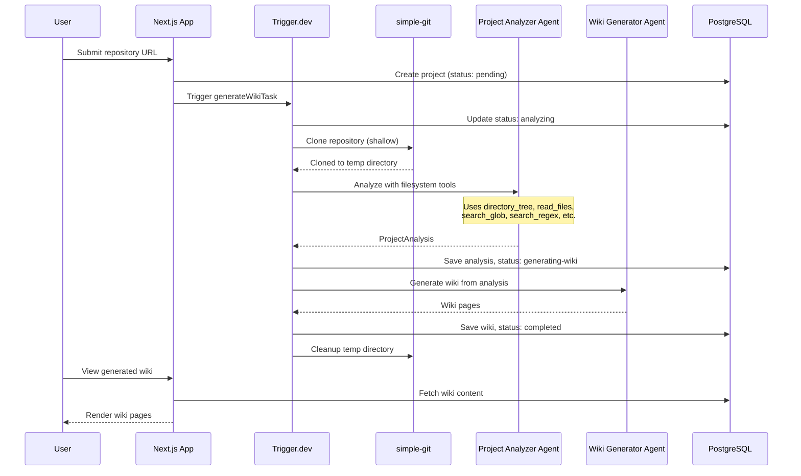

# AutoWiki

AI-powered documentation generator for your codebase. Connect a GitHub
repository and get a comprehensive wiki in minutes.

## Features

- **Instant Analysis** — Clone any public GitHub repo and understand its
  architecture
- **AI-Powered** — Two specialized agents analyze code and generate
  documentation
- **Rich Documentation** — Feature pages, cross-references, and direct links to
  source files
- **Beautiful UI** — Modern, navigable wiki interface

## Quick Start

### Prerequisites

- [Bun](https://bun.sh) (recommended) or Node.js 20+
- PostgreSQL database ([Neon](https://neon.tech) recommended)
- [Trigger.dev](https://trigger.dev) account
- OpenAI or Google AI API key

### Setup

```bash
# Clone and install
git clone https://github.com/your-org/autowiki.git
cd autowiki
bun install

# Configure environment
cp .env.example .env
```

**Required environment variables:**

```env
DATABASE_URL="postgresql://..."
OPENAI_API_KEY="sk-..."              # or GOOGLE_GENERATIVE_AI_API_KEY
ANALYZER_MODEL="openai/gpt-5-mini"
GENERATOR_MODEL="openai/gpt-5-mini"
TRIGGER_SECRET_KEY="tr_dev_..."
```

```bash
# Run migrations and start
bun drizzle-kit push
bun dev

# In a separate terminal
bunx trigger.dev dev
```

Open [http://localhost:3000](http://localhost:3000) to use AutoWiki.

## How It Works

AutoWiki uses two specialized AI agents orchestrated by Trigger.dev:

| Agent                | Role                                                                                                     |
| -------------------- | -------------------------------------------------------------------------------------------------------- |
| **Project Analyzer** | Clones the repository, explores structure using filesystem tools, identifies features, maps dependencies |
| **Wiki Generator**   | Transforms the analysis into a navigable wiki with home page, feature pages, and cross-references        |

### Architecture



## Tech Stack

| Category        | Technology                                                                   |
| --------------- | ---------------------------------------------------------------------------- |
| Framework       | [Next.js](https://nextjs.org) with App Router                                |
| AI Agents       | [Mastra](https://mastra.ai)                                                  |
| Background Jobs | [Trigger.dev](https://trigger.dev)                                           |
| Database        | [Neon](https://neon.tech) + [Drizzle ORM](https://orm.drizzle.team)          |
| API             | [tRPC](https://trpc.io)                                                      |
| Styling         | [Tailwind CSS](https://tailwindcss.com) + [shadcn/ui](https://ui.shadcn.com) |

## Project Structure

```
src/
├── app/                    # Next.js App Router pages
│   └── projects/           # Wiki viewer
├── components/             # React components
├── db/                     # Database schema and client
├── mastra/                 # AI agents
│   ├── agents/             # Agent definitions
│   └── tools/              # Filesystem tools for repo analysis
├── schemas/                # Zod schemas
├── trigger/                # Background tasks
└── trpc/                   # tRPC routers
```

## Author

Created by
[Sheikh Uzair Hussain](https://www.linkedin.com/in/sheikhuzairhussain)

## License

MIT
